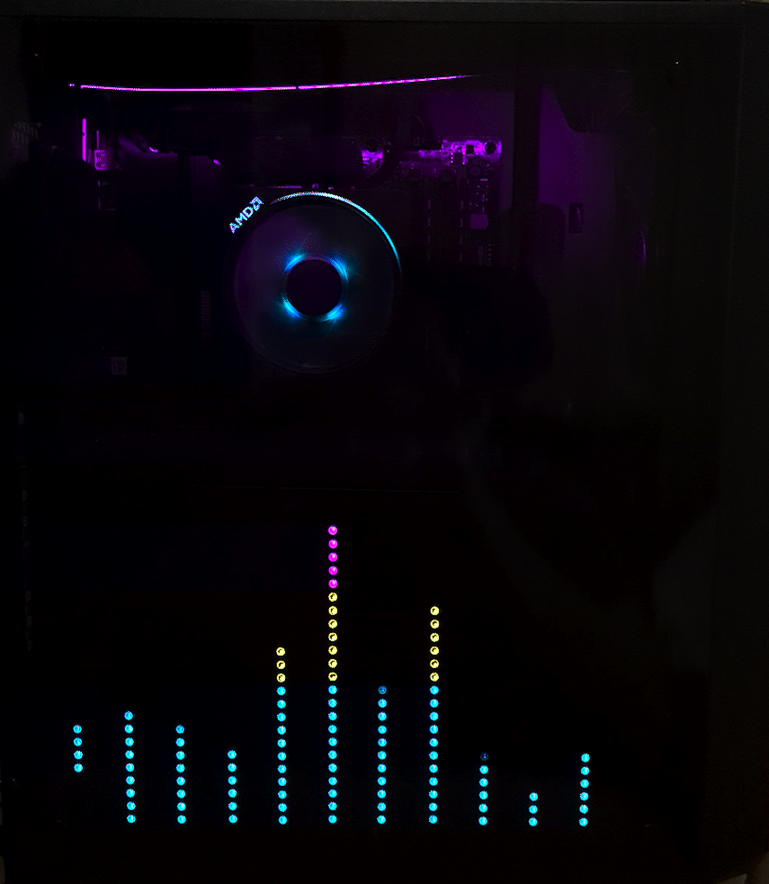
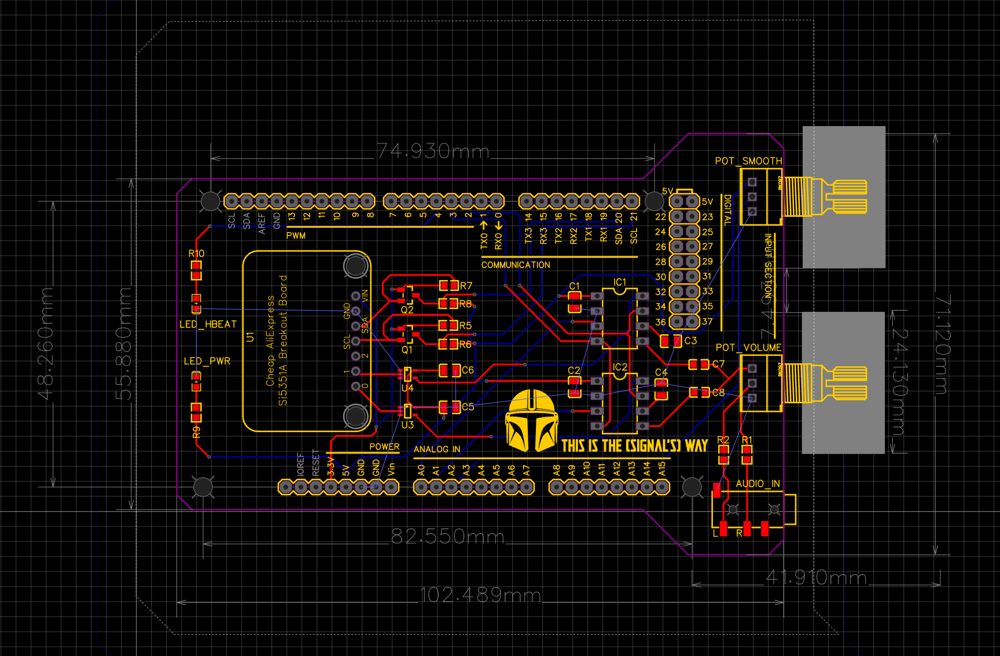

# MiSpecky LED Spectrum analyzer
MiSpecky is an arduino-based project for and LED strip audio spectrum analyzer. It uses hardware components for the audio frequency slicing, so it has incredibly fast response times, and not much software delay.

(The GIF takes a few moments to load...)  

The intention was to incorporate it into my PC's case (Fractal Design Meshify C)

## Overview
The components of this project are:
- Arduino Mega Board
- Custom PCB board that acts as an shield/hat
    - along with accompanying hardware components
- LED strip assembled onto a board
- [Companion GUI controller application](https://github.com/Mihax209/mispecky-gui-controller)

## Video demonstration
This video showcases the box and companion GUI app features

https://www.youtube.com/watch?v=yOwKhR_m7uo

## Arduino+Shield Box
The PCB is basically only a carrier board for the two MSGEQ7 chips (IC1/2) responsible for the audio splicing.

The Si5351A board (U1) is just two clock generators, needed to configure the audio chararcteristics of the MSGEQ7 chips.

Next to the two knobs (potentiometers), there is a 3.5mm audio input.  

With the help of my dad we've designed and 3d printed a box for the MiSpecky to sit inside, with the knobs and audio jack accessible for user input.  

## LED Strip Board
The LED strip board took some POC-ing to figure out how to make it look just right  

A lot of work as been put in to accurately measure the PC's case (and glass panel) so it would fit and hold well without any adhesives, so accessing the PC's internals is still easily possible. Once again my dad helped immensely with all of the CAD and 3d printing process.  

The final board was constructed with a cut and painted aluminum sheet, with 3d printed grooves/trenches for the wires to follow neatly.  

The board was then taped with black electrical tape, and dark PVC tape to completely darken everything, so only the LED lights were showing through the tinted PC glass.

## Software design
The software is composed of 3 simple modules, controlled by the main module (mispecky).
- spectrum
    - handles the MSGEQ7 chips to receive and translate audio data
- led
    - handles parsing the spectrum data into the LED lighting effect
- commands
    - handles serial port commands received from the companion GUI app, and changing the led effects as needed

## Credits
The general solution approach and initial project basis was heavily infuinced by Daniel Perez's work on his Specky Board: https://www.youtube.com/watch?v=TyE-EoX5xc8.

He goes into a lot of details and explanations on the hardware components, so I'd highly advice checking him out.

I have even been in contact with him asking some questions, so thanks a lot for helping!
